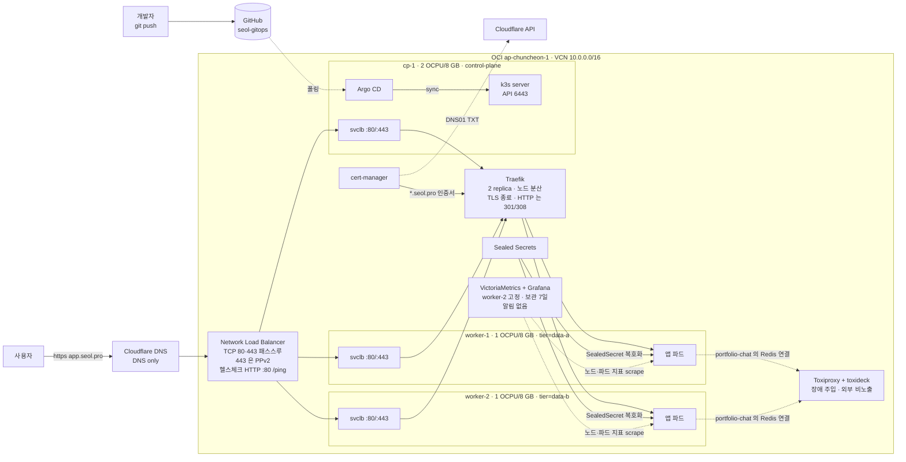

# seol-gitops

k3s 클러스터를 Argo CD 로 운영하는 GitOps 레포지터리, `main` 브랜치가 클러스터의 최종 상태이고, 변경은 git push 로만 진행한다.

## 구성



| 노드 | 역할 | 사양 | 사설 IP | 공인 IP | 라벨 |
|---|---|---|---|---|---|
| cp-1 | k3s server, Argo CD | 2 OCPU / 8 GB | 10.0.0.1xx | 152.69.xxx.xxx | `node-role.kubernetes.io/control-plane=true` |
| worker-1 | k3s agent | 1 OCPU / 8 GB | 10.0.0.xx | 168.107.xxx.xxx | `tier=data-a` |
| worker-2 | k3s agent | 1 OCPU / 8 GB | 10.0.0.2xx | 134.185.xxx.xxx | `tier=data-b` |

- 파드 CIDR `10.42.0.0/16`, 서비스 CIDR `10.43.0.0/16`
- k3s 기본 구성: SQLite, Traefik(Ingress), ServiceLB, local-path(기본 StorageClass), metrics-server. secrets-encryption 활성
- 도메인 `seol.pro` (Cloudflare, DNS only). 앱별 A 레코드는 수동으로 추가한다.
- `http` 요청은 Traefik 이 전량 `https` 로 보내고(GET 은 301, 그 외 메서드는 308), 응답에 HSTS `max-age=31536000` 을 붙인다.
- 앱 A 레코드는 NLB 공인 IP(`146.56.xxx.xxx`)를 가리킨다. 노드 80/443 은 NSG 로 NLB 만 허용하므로 노드 공인 IP 직접 접속은 막혀 있고, 진입점은 NLB 하나다.

## 레포 구조

```
argocd/           루트 App of Apps(root.yaml) 와 자식 Application(applications/)
infra/            Argo CD, Sealed Secrets, cert-manager, ClusterIssuer·와일드카드 인증서, Traefik 설정, 모니터링
apps/             앱별 디렉터리 (규약: apps/README.md)
docs/runbook.md   운영 절차
hack/             pre-commit 훅 스크립트
```

`argocd/root.yaml` 하나만 kubectl 로 등록하면 루트가 `argocd/applications/` 를 감시하며 `infra/`, `apps/` 를 배포한다.

## 버전

| 컴포넌트 | 버전 |
|---|---|
| k3s | v1.36.3+k3s1 |
| Argo CD | v3.5.1 (비HA, upstream install.yaml + kustomize 패치) |
| Sealed Secrets | chart 2.19.3 / app 0.39.1 |
| cert-manager | chart v1.21.1 |
| Traefik | chart 40.1.4+up40.1.0 (k3s 내장, HelmChartConfig 로 값만 덮어씀) |
| VictoriaMetrics | chart 0.91.2 / app v1.150.0 (k8s-stack, 알림 컴포넌트 제외) |
| Toxiproxy | 2.12.0 |
| toxideck | 0.1.0 |

## 시크릿 정책

- 클러스터 시크릿은 SealedSecret(`*.sealedsecret.yaml`)만 커밋한다. 평문은 `*.plain.yaml` 로 두면 `.gitignore` 가 차단한다.
- `pre-commit` 훅(gitleaks + 평문 `kind: Secret` 검사 + kustomize build 검증)이 커밋 시 검사한다.

## 로컬 준비

```bash
brew install kubernetes-cli kubeseal gitleaks pre-commit k9s helm
pre-commit install
```

kubeconfig 구성과 운영 절차는 `docs/runbook.md`.

## 대시보드

모두 `kubectl port-forward` 로만 접근한다.

| 대상 | 명령 | 주소 | 계정 |
|---|---|---|---|
| k9s | `k9s` | 터미널 UI | kubeconfig 사용, 계정 없음 |
| Argo CD | `kubectl -n argocd port-forward svc/argocd-server 8080:80` | `http://localhost:8080` | `admin` / 아래 명령으로 확인 |
| Grafana | `kubectl -n monitoring port-forward svc/vm-grafana 3000:80` | `http://localhost:3000` | 열람은 로그인 없이, 편집은 `admin` |
| toxideck | `kubectl -n chaos port-forward deploy/toxiproxy 8090:8080` | `http://localhost:8090` | 없음, 인증이 없어 노출 금지 |

비밀번호 확인

```bash
kubectl -n argocd get secret argocd-initial-admin-secret -o jsonpath='{.data.password}' | base64 -d; echo
kubectl -n monitoring get secret grafana-admin -o jsonpath='{.data.admin-password}' | base64 -d; echo
```

## 앱 추가

네임스페이스 → `apps/<앱>/` → (프라이빗 이미지면 imagePullSecret 을 SealedSecret 으로) → `argocd/applications/app-<앱>.yaml` → push. 규약은 `apps/README.md`.
